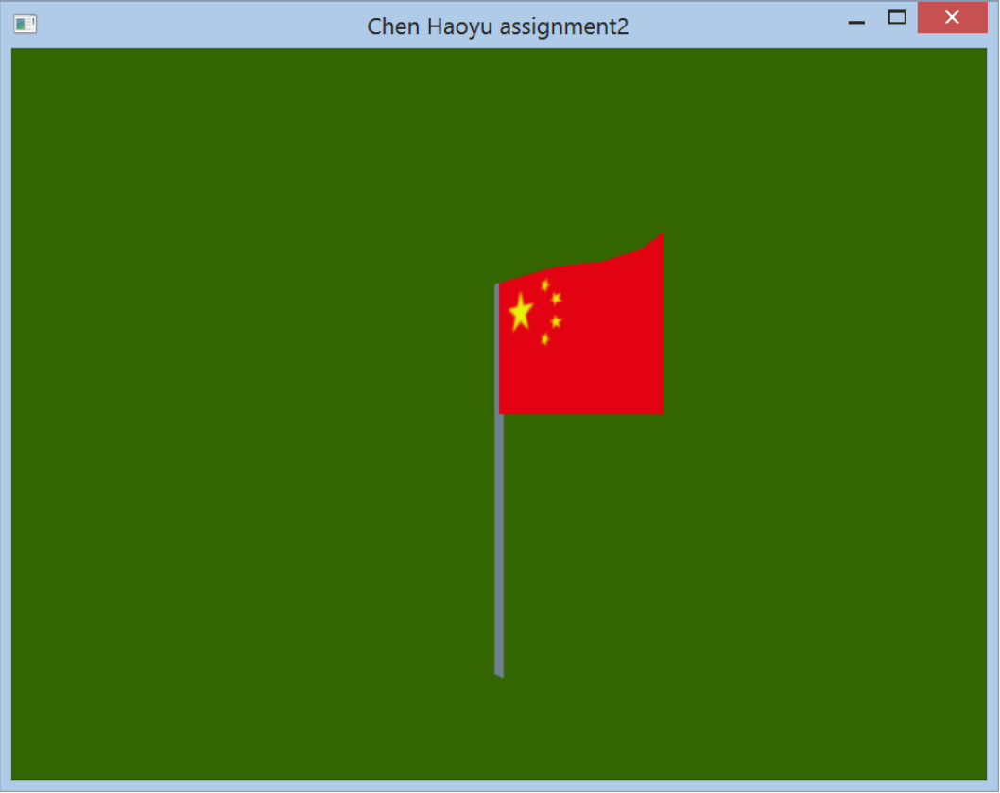
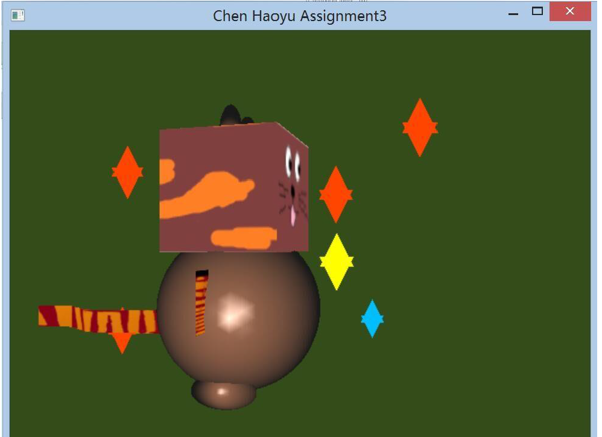

# Computer-Graphic-funny-stuff
A CG animation made by myself

1. 做了一个流动的国旗，五星红旗迎风飘扬

2. 做了一个卡通猫，手脚都会动
The scene can be controlled by keyboard:
Press key ‘w’, ’s’, ’a’, ’d’ to move viewpoint to up, down, left and right.
Use mouse middle roll to move viewpoint to ahead and back.
Press key ‘m’ to add one star. Max for 30 stars.
Press key ‘n’ to remove one star.
Press key ’q’ to quit the program.

